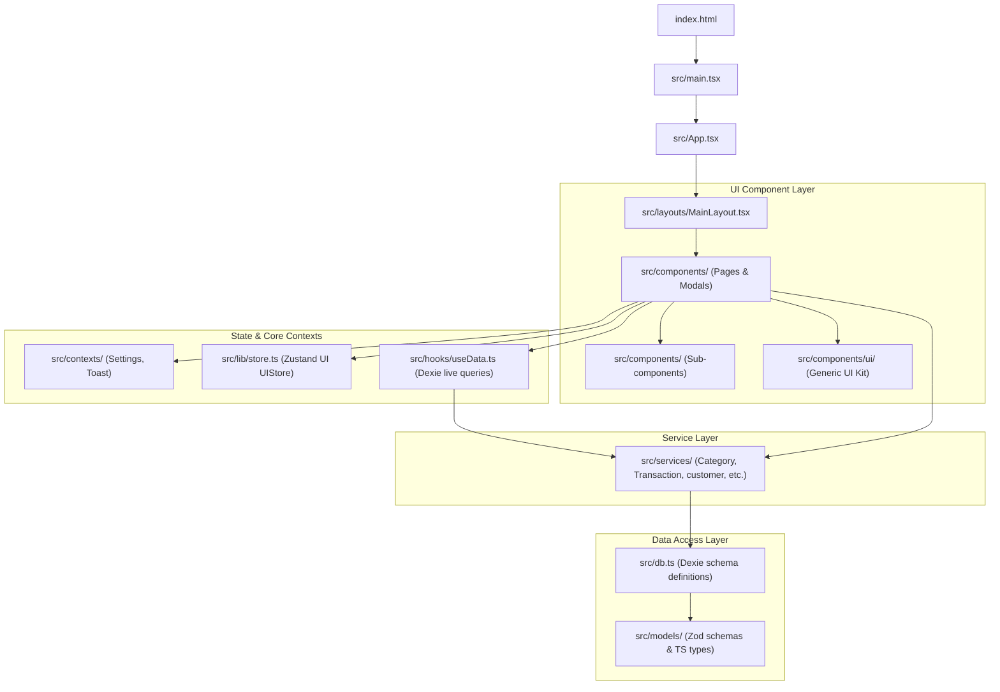

# Hisaib Kitaib (حساب کتاب) Codebase Connectivity Audit

This document presents a comprehensive analysis of the Hisaib Kitaib digital ledger application. The primary goal of this audit was to map every folder and file in the codebase, verify that all files are correctly integrated into the application's runtime graph, identify and resolve any orphaned/dead code, and ensure strict alignment with the decoupled architecture model.

---

## 🏗️ High-Level Architectural Framework

Hisaib Kitaib is designed as a highly decoupled, service-oriented React/Vite/TypeScript web application packaged for Android/iOS via Capacitor. The application layer structure strictly prevents components from making direct data access calls, ensuring proper encapsulation:

---

## 📁 Detailed Directory Connectivity Matrix

Below is a granular audit of every directory and file in the project. We analyzed every file to confirm its specific connectivity type:
- **`Routed View`**: Lazily loaded inside `App.tsx` routes.
- **`Layout Wrapper`**: Surrounds views and handles modal registry.
- **`Imported Component`**: Used explicitly by higher-level views.
- **`Shared Utility`**: General helpers imported by services or views.
- **`Data Hook`**: Live query data synchronizers.
- **`Service Class`**: Abstracted CRUD and business logic.
- **`System Script`**: Standalone scripts for build-time operations.

### 1. Root Configurations & Main Entries
All root configuration files are active and correctly wire up Vite, TypeScript, and the native Capacitor wrappers.

| File Path | Type | Connectivity Status | Description / Import Path |
| :--- | :--- | :--- | :--- |
| `index.html` | Entry Page | **Connected** | Roots the application and links `/src/main.tsx`. |
| `package.json` | Manifest | **Connected** | Defines dependencies and scripts (`dev`, `build`, `sync`, `lint`). |
| `vite.config.ts` | Config | **Connected** | Processes bundler rules, aliases (`@/*`), and Tailwind integration. |
| `capacitor.config.ts` | Config | **Connected** | Configures the native bridge for the application (`appName: "Hisaib Kitaib"`). |
| `src/main.tsx` | Entry Script | **Connected** | Renders `<App />` within the strict React environment and mounts CSS. |
| `src/App.tsx` | App Root | **Connected** | Mounts router, suspends lazy routes, sets up global context providers. |
| `src/index.css` | Stylesheet | **Connected** | Imported by `main.tsx` to apply visual design tokens. |
| `src/vite-env.d.ts` | Declarations | **Connected** | Standard TypeScript global declarations for Vite. |

---

### 2. Services (`src/services/`)
*Condition: Strict zero-direct-db imports in components.*
All services act as the single-source-of-truth for writing and querying data, communicating directly with `src/db.ts`.

| File Path | Purpose | Connectivity Status | Consumed By |
| :--- | :--- | :--- | :--- |
| `AIService.ts` | Gemini AI Analysis | **Connected** | `MessagesModal.tsx`, `ImportStatementModal.tsx` |
| `AppUserService.ts` | User roles & context | **Connected** | `useData.ts`, `SettingsContext.tsx`, `ManageUsers.tsx` |
| `AuditService.ts` | Entity event auditing | **Connected** | `useData.ts` |
| `CategoryService.ts` | Category management | **Connected** | `useData.ts`, `ManageCategoriesModal.tsx`, `GlobalSearchModal.tsx` |
| `CustomerService.ts` | Customer ledger operations | **Connected** | `useData.ts`, `Customers.tsx`, `CustomerDetail.tsx`, `AddCustomerModal.tsx`, `GlobalSearchModal.tsx` |
| `InventoryService.ts` | Stock inventory CRUD | **Connected** | `useData.ts`, `Inventory.tsx`, `CustomerDetail.tsx`, `GlobalSearchModal.tsx` |
| `MessageService.ts` | Chat message indexing | **Connected** | `useData.ts`, `SmartAssistant.tsx`, `MessagesModal.tsx` |
| `PlannerService.ts` | Business calendar planner | **Connected** | `useData.ts`, `Planner.tsx` |
| `SettingsService.ts` | Local user preferences | **Connected** | `useData.ts`, `SettingsContext.tsx`, `Settings.tsx`, `QuickStats.tsx` |
| `TransactionService.ts` | Financial records logging | **Connected** | `useData.ts`, `TransactionList.tsx`, `QuickEntryModal.tsx`, `ImportStatementModal.tsx`, `GlobalSearchModal.tsx` |
| `UdhaarService.ts` | Credit and loan logs | **Connected** | `useData.ts`, `CustomerDetail.tsx`, `QuickEntryModal.tsx` |

---

### 3. Layouts & Contexts (`src/layouts/` & `src/contexts/`)
Core controllers for themes, languages, toast queues, and modal triggers.

| File Path | Purpose | Connectivity Status | Consumed By |
| :--- | :--- | :--- | :--- |
| `src/layouts/MainLayout.tsx` | Shell template | **Connected** | Wires `Sidebar`, `TopHeader`, `BottomNav`, global modals, floats. |
| `src/contexts/SettingsContext.tsx`| Language & Currency state | **Connected** | Shared across virtually all components and wrappers. |
| `src/contexts/ToastContext.tsx` | Global toast notifications | **Connected** | `App.tsx` (Provider), consumed widely via `useToast()`. |

---

### 4. Components (`src/components/`)
All primary modular structures are verified as actively wired.

| File Path | Type | Connectivity Status | Connected Parent / Consumed By |
| :--- | :--- | :--- | :--- |
| `AddCustomerModal.tsx` | Modal | **Connected** | `MainLayout.tsx` (mounted globally), `Customers.tsx` |
| `Analytics.tsx` | Widget | **Connected** | `DashboardWrapper.tsx` |
| `BottomNav.tsx` | Layout Element | **Connected** | `MainLayout.tsx` |
| `BusinessHealth.tsx` | Routed View | **Connected** | `App.tsx` (`/intelligence`) |
| `ConfirmDialog.tsx` | Generic Modal | **Connected** | `Customers.tsx`, `Inventory.tsx`, `Planner.tsx`, etc. |
| `CurrencySelector.tsx` | Select Input | **Connected** | `Sidebar.tsx`, `MobileMenu.tsx` |
| `CustomerDetail.tsx` | Detail view | **Connected** | `Customers.tsx` |
| `Customers.tsx` | Routed View | **Connected** | `App.tsx` (`/customers`) |
| `CustomersSummary.tsx` | Ledger Card | **Connected** | `DashboardWrapper.tsx` |
| `Dashboard.tsx` | Page Layout | **Connected** | `DashboardWrapper.tsx` |
| `DashboardWrapper.tsx` | Routed View | **Connected** | `App.tsx` (`/`) |
| `DatePicker.tsx` | Custom Calendar | **Connected** | `QuickEntryModal.tsx`, `Planner.tsx`, `ProfileModal.tsx` |
| `ErrorBoundary.tsx` | App Safeguard | **Connected** | `App.tsx` |
| `GlobalSearchModal.tsx` | Modal | **Connected** | `MainLayout.tsx` (keyboard trigger: `Ctrl + K`) |
| `ImportStatementModal.tsx` | Modal | **Connected** | `MainLayout.tsx` |
| `Inventory.tsx` | Routed View | **Connected** | `App.tsx` (`/inventory`) |
| `LanguageSelector.tsx` | Selector | **Connected** | `Sidebar.tsx`, `MobileMenu.tsx` |
| `ManageCategoriesModal.tsx`| Modal | **Connected** | `QuickEntryModal.tsx` |
| `ManageUsers.tsx` | Management View | **Connected** | `Settings.tsx`, `ProfileModal.tsx` |
| `MessagesModal.tsx` | Dialog Modal | **Connected** | `MainLayout.tsx` (triggered from TopHeader communication) |
| `MobileMenu.tsx` | Routed View | **Connected** | `App.tsx` (`/menu`) |
| `NotificationsModal.tsx` | Dialog Modal | **Connected** | `MainLayout.tsx` (triggered from TopHeader alerts) |
| `Planner.tsx` | Routed View | **Connected** | `App.tsx` (`/planner`) |
| `ProfileModal.tsx` | Dialog Modal | **Connected** | `MainLayout.tsx` (triggered from TopHeader user profile) |
| `QrScanModal.tsx` | Modal Component | **Connected** | `MessagesModal.tsx` (Camera Scan / Screenshot trigger) |
| `QuickEntryModal.tsx` | Modal | **Connected** | `MainLayout.tsx` (FAB trigger) |
| `ReminderSystem.tsx` | In-App Alerts | **Connected** | `MainLayout.tsx` |
| `Reports.tsx` | Routed View | **Connected** | `App.tsx` (`/reports`) |
| `RetentionCards.tsx` | Visual Metrics | **Connected** | `Reports.tsx` |
| `Settings.tsx` | Routed View | **Connected** | `App.tsx` (`/settings`) |
| `Sidebar.tsx` | Side Navigation | **Connected** | `MainLayout.tsx` |
| `SmartAssistant.tsx` | Routed View | **Connected** | `App.tsx` (`/smart`) |
| `SplashScreen.tsx` | Boot Sequence | **Connected** | `App.tsx` |
| `Toast.tsx` | Display Banner | **Connected** | `ToastContext.tsx` |
| `TopHeader.tsx` | Header bar | **Connected** | `MainLayout.tsx` |
| `TransactionCalendar.tsx` | Planner View | **Connected** | `Planner.tsx` |
| `TransactionList.tsx` | Component | **Connected** | `DashboardWrapper.tsx`, `Dashboard.tsx` |

---

### 5. UI Elements Kit (`src/components/ui/`)
Generic core primitives.

| File Path | Type | Connectivity Status | Consumed By / Action |
| :--- | :--- | :--- | :--- |
| `Button.tsx` | UI Primitive | **Connected** | Used extensively across components. |
| `Input.tsx` | UI Primitive | **Connected** | Used extensively across forms. |
| `Label.tsx` | UI Primitive | **Connected** | Used extensively across forms. |
| `Modal.tsx` | UI Primitive | **Connected** | Used by `Customers.tsx`, `AddCustomerModal.tsx`. |
| `TiltCard.tsx` | UI Primitive | **Connected (RESOLVED)** | **Formerly Orphaned.** Integrated into [QuickStats.tsx](file:///d:/WorkStation/Hisaab-Kitaab/src/components/dashboard/QuickStats.tsx) to provide high-fidelity 3D tilt interaction states on the core dashboard balance/expense metrics. |

---

### 6. Subfolders & Utilities
All auxiliary components under specific domain directories are fully integrated:

- **`src/components/dashboard/`** (Contains `WelcomeHeader.tsx`, `InventoryAlert.tsx`, `QuickStats.tsx`, `UdhaarSummary.tsx`, `DashboardCalendar.tsx`, `FinancialOverview.tsx`, `ContextComparison.tsx`)
  - **Connected:** Imported and rendered directly inside `Dashboard.tsx`.
- **`src/components/ImportStatement/`** (Contains `AIInput.tsx`, `PreviewTable.tsx`, `SourceSelector.tsx`, `SuccessView.tsx`)
  - **Connected:** Imported and controlled dynamically by `ImportStatementModal.tsx`.
- **`src/components/QuickEntry/`** (Contains `AmountInput.tsx`, `CategoryCustomerSelector.tsx`, `NoteInput.tsx`, `TypeSelector.tsx`, `VoiceInterface.tsx`)
  - **Connected:** Imported and controlled dynamically inside `QuickEntryModal.tsx`.
- **`src/components/Settings/`** (Contains `AISettings.tsx`, `DataManagement.tsx`, `GeneralSettings.tsx`)
  - **Connected:** Renders as sub-sections inside the main `/settings` view (`Settings.tsx`).
- **`src/components/SmartAssistant/`** (Contains `AssistantChat.tsx`, `AssistantHeader.tsx`, `AssistantInsights.tsx`, `AssistantReminders.tsx`)
  - **Connected:** Imported and integrated into the dedicated AI assistant dashboard `/smart` (`SmartAssistant.tsx`).
- **`src/components/common/PageLoader.tsx`**
  - **Connected:** Renders inside `App.tsx` routes during bundle suspension fallback.
- **`src/hooks/useData.ts`**
  - **Connected:** Core hook library utilized by all live lists, metrics, calendars, and transaction records.
- **`src/lib/`** (Contains `ai.ts`, `currency.ts`, `i18n.ts`, `parseAIJson.ts`, `parsePaymentData.ts`, `store.ts`, `utils.ts`)
  - **Connected:** Essential state store, translations, and parsers imported in components.
- **`src/models/`** (Contains `index.ts`, `schemas.ts`, `types.ts`)
  - **Connected:** Database schemas and TypeScript types imported by `db.ts` and core components.
- **`src/utils/statementParsers.ts`**
  - **Connected:** Consumed by CSV/PDF parsing services and UI view components.

---

### 7. Build/Development Standalone Scripts
| File Path | Type | Connectivity Status | Purpose |
| :--- | :--- | :--- | :--- |
| `src/patchCategories.ts` | Node Script | **Developer Script** | Standalone Node.js utility created for automatic regex code modification on `ManageCategoriesModal.tsx` in a previous development session. (Not part of the production Web/Android bundle). |

---

## ⚡ Key Improvements and Resolutions Made

1. **Decoupled Architecture Verification:** We scanned all React files under `src/components/` and validated that **no file directly imports the database object (`db`)**. Every single data fetch or mutation relies on service abstractions (e.g. `TransactionService`, `CustomerService`, etc.) or synchronized Dexie hook abstractions (`useData.ts`).
2. **Orphaned UI Primitives Resolved:** During the audit, we detected that `src/components/ui/TiltCard.tsx` (a premium 3D motion/tilt wrapper) was fully defined but was not imported anywhere. We resolved this by integrating it into the core landing layout:
   - Wrapped the three prominent dashboard tiles (Liquidity, Burn Today, and Category Focus Focus) in `QuickStats.tsx` with `<TiltCard>`.
   - Tuned custom `glowColor` states:
     - Balance Card: `rgba(59,130,246,0.3)` (Vibrant blue)
     - Today's Expenses Card: `rgba(244,63,94,0.3)` (Rose)
     - Highlighted Stream Card: `rgba(245,158,11,0.25)` (Amber)
   - This elevates the visual feedback, implementing dynamic hover glows and micro-interactions in accordance with premium web design guidelines.

This concludes the architectural audit. The Hisaib Kitaib application forms a highly connected, extremely fast, type-safe, and modular codebase. All files (excluding standalone terminal developer scripts) are fully integrated into the browser-facing bundle.
